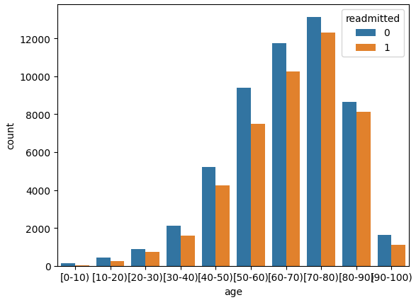
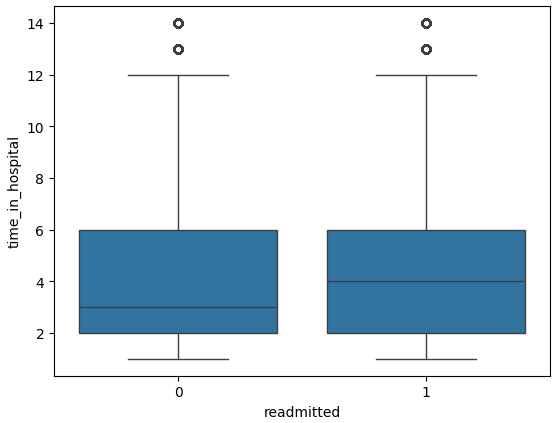
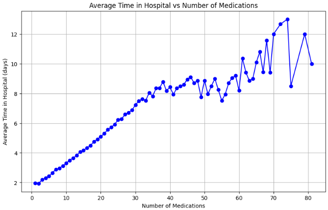
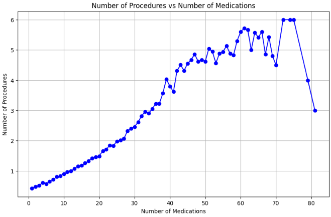
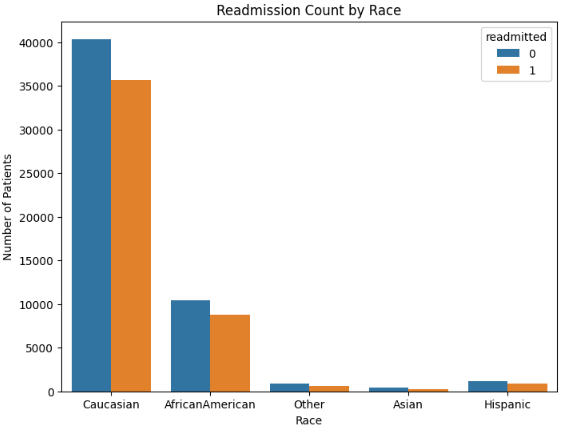
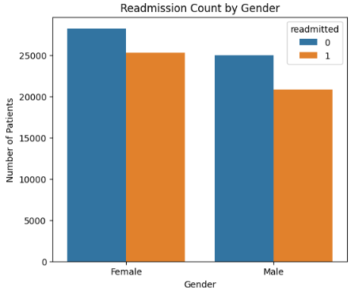

# 🏥 Hospital Readmission Analysis

Hospital readmissions are a significant concern in healthcare, as they can indicate complications, poor post-discharge care, or ineffective treatment. The goal of this project is to **analyze hospital patient data** and **predict readmission risk**, providing actionable insights to improve patient outcomes and reduce hospital costs.

---

## 🧠 Problem Statement
Hospitals face high costs and penalties when patients are readmitted within 30 days of discharge. These readmissions often indicate poor care coordination, unplanned complications, or lack of follow-up.  

Goal: Identify key factors that lead to patient readmissions and predict the likelihood of a patient being readmitted.

---

## 📊 Dataset Description
The dataset contains **101,766 patient records** with demographics, hospital visits, lab results, medications, and readmission status. Key columns include:

| Column | Description |
|--------|-------------|
| `race` | Patient race |
| `gender` | Patient gender |
| `age` | Patient age group |
| `admission_type_id` | Type of hospital admission (emergency, urgent, elective) |
| `discharge_disposition_id` | Discharge status (home, rehab, etc.) |
| `time_in_hospital` | Number of days in hospital |
| `num_lab_procedures` | Number of lab tests performed |
| `num_procedures` | Number of medical procedures |
| `num_medications` | Number of medications prescribed |
| `number_outpatient`, `number_emergency`, `number_inpatient` | Number of prior visits |
| `number_diagnoses` | Number of diagnoses for the patient |
| `A1Cresult` | Average blood sugar control |
| `max_glu_serum` | Maximum glucose serum result |
| `insulin`, `metformin`, `change`, `diabetesMed` | Medication information |
| `readmitted` | Target variable (0 = Not readmitted, 1 = Readmitted) |

---

## 🧹 Data Cleaning Steps
- Removed rows with missing or unknown values (`?`) in critical columns.  
- Converted categorical columns to **numeric using one-hot encoding** for modeling.  
- Checked for duplicates and removed irrelevant identifiers like `encounter_id` and `patient_nbr`.  
- Simplified target variable: `readmitted` → 0 (No) and 1 (Yes).  

---

## 🔍 Exploratory Data Analysis (EDA) & Insights

### 1️⃣ Age vs Readmission
- Observation: **Readmission increases with age**.  
- Actionable Insight: Older patients require more follow-up care post-discharge.
#### Graph:

### 2️⃣ Time in Hospital vs Readmission
- Observation: **No significant effect** on readmission.  
- Actionable Insight: Extending hospital stay alone does not reduce readmission risk.
#### Graph:

### 3️⃣ Number of Medications vs Time in Hospital
- Observation: **Linear relationship** — more medications → slightly longer hospital stays.  
- Actionable Insight: Patients on multiple medications need careful monitoring to avoid complications.
#### Graph:

### 4️⃣ Number of Procedures vs Number of Medications
- Observation: **Linear relationship** — more procedures → more medications.  
- Actionable Insight: Complex treatment plans require additional attention to reduce readmissions.
#### Graph:

### 5️⃣ Race & Gender vs Readmission
- Observation: **Caucasian patients** and **female patients** have higher readmission counts.  
- Actionable Insight: Focused post-discharge care for these groups can reduce readmission.
#### Graph 1:

#### Graph 2:

---

## 📈 Visualizations
- **Line Graph:** Average Time in Hospital vs Number of Medications  
- **Scatter Plot:** Number of Procedures vs Number of Medications  
- **Bar Charts:** Readmission counts by Race and Gender  
- **Boxplots:** Time in Hospital vs Readmission  

> These visualizations help identify trends and patterns in patient readmissions.

---

## 💡 Recommendations
1. Prioritize **follow-up care for elderly patients** to prevent readmissions.  
2. Monitor **polypharmacy patients** closely during and after hospitalization.  
3. Evaluate treatment plans for **patients with multiple procedures**.  
4. Implement **targeted post-discharge care** for Caucasian and female patients.  
5. Use insights to **develop predictive models** for early identification of high-risk patients.

---

## 🧰 Tech Stack

| Category | Tools |
|-----------|-------|
| Language | Python |
| Data Handling | Pandas, NumPy |
| Visualization | Matplotlib, Seaborn |
| dashboard | Tableau |

---

## 👨‍💻 Author

**Bhushan Yashwant Patil**  
📧  Email: patilbhushan1086@gmail.com  
💼  LinkedIn Profile: https://www.linkedin.com/in/bhushan-patil-381601293/  
📂  GitHub Portfolio: https://bhushanyp.github.io/portfolio/

---
